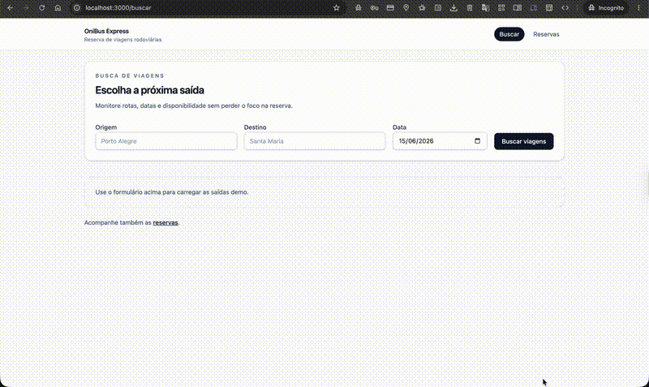

# OniBus Express

Full-stack MVP for the OniBus Express technical challenge.



## What It Does

- Search trips by origin, destination, and date.
- View trip details and seat availability.
- Select a seat and create a reservation.
- Validate CPF on both frontend and backend.
- Consult and cancel reservations by code.

## Stack

- .NET 8 Web API
- Entity Framework Core
- PostgreSQL in Docker Compose
- SQLite in-memory for integration tests
- React 18 + TypeScript + Vite
- React Router
- Tailwind CSS v4
- Vitest + React Testing Library
- Docker and Nginx

## Architecture

The backend uses a layered structure:

- `Domain` for entities and business rules
- `Application` for use cases and DTOs
- `Infrastructure` for EF Core, persistence, and seed data
- `Api` for HTTP endpoints, Swagger, and startup wiring

The frontend uses routed screens for the full booking flow:

- Search
- Seat selection
- Checkout
- Reservation success
- Reservation lookup

## Run With Docker

Start the full stack with one command:

```bash
docker compose up --build
```

After the stack is up:

- Frontend: http://localhost:3000
- API Swagger: http://localhost:8080/swagger

The compose file starts PostgreSQL, the API, and the frontend container served by Nginx.

## Run Locally Without Docker

### Backend

The API is built for PostgreSQL in the containerized setup, but it also has a local SQLite fallback when no connection string is provided.

```bash
cd backend
dotnet restore OnibusExpress.sln
dotnet run --project src/OnibusExpress.Api/OnibusExpress.Api.csproj
```

If you want to run the backend against PostgreSQL locally, set `ConnectionStrings__Default` before starting the API.

### Frontend

```bash
cd frontend
npm install
npm run dev
```

The frontend dev server runs on the default Vite port.

## Tests

Run backend tests:

```bash
dotnet test backend/OnibusExpress.sln
```

Run frontend tests:

```bash
cd frontend
npm test -- --run
```

Run the frontend build:

```bash
cd frontend
npm run build
```

## Endpoints

- `GET /rotas`
- `GET /viagens?origem=&destino=&data=`
- `GET /viagens/{id}`
- `POST /reservas`
- `GET /reservas/{codigo}`
- `DELETE /reservas/{codigo}`

Swagger is available at `/swagger` when the API is running.

## Design Choices

- The backend keeps business rules in `Domain` and use cases in `Application`.
- Reservation creation blocks occupied seats, past trips, and invalid CPF values.
- Cancellation is only allowed up to two hours before departure.
- The frontend uses route-based screens so each step of the booking flow is explicit.
- The UI uses small local primitives inspired by Untitled UI React instead of a large component dependency.
- Docker Compose runs PostgreSQL for the app, while integration tests use SQLite in-memory for speed.

## Seed Data

The API seeds a small demo catalog with Brazilian routes, future trips, and occupied seats so the app is useful immediately after startup.

## Implemented Scope

- Search trips
- Seat selection
- Passenger checkout
- Reservation success screen
- Reservation lookup and cancel
- Swagger
- Docker Compose
- Backend and frontend tests

## Out Of Scope

- Payments
- Authentication
- Admin screens
- Production deployment

## Future Improvements

- Add a dedicated database migration workflow.
